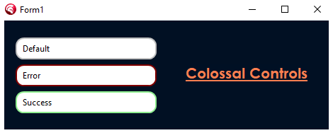

# Colossal Controls

A collection of custom VCL components for Delphi.

Components are registered on the **Colossal Controls** tab of the Tool Palette.

## Components

### TRoundEdit

An edit box with rounded corners. The frame is drawn with **GDI+** using anti-aliasing, so the corners are smooth instead of jagged (which is what you get when clipping a window with `SetWindowRgn`).



`TRoundEdit` is a `TCustomControl` that paints the rounded frame and hosts a borderless `TEdit` inside it. The inner edit's height is set from the real font height and centered vertically, so the text stays aligned at any font size.

**Features**

- Anti-aliased rounded corners (GDI+)
- Configurable corner radius, border width, and colors
- Different border color when the edit has focus
- Text is vertically centered and follows font changes
- Transparent corners (opt-in with `Transparent = True`): the control paints what is behind it, so it looks right over any parent or sibling. By default the corners are filled with the parent's color
- Cannot be used as a parent for other components (`csAcceptsControls` removed)
- Double buffered, no flicker

**Published properties**

| Property      | Type     | Default   | Description                                   |
|---------------|----------|-----------|-----------------------------------------------|
| `Text`        | string   |           | Text of the inner edit                        |
| `Radius`      | Integer  | `10`      | Corner radius in pixels                       |
| `BorderWidth` | Integer  | `1`       | Border thickness in pixels (`0` = no border)  |
| `BorderColor` | TColor   | `$00C0C0C0` | Border color when not focused               |
| `FocusColor`  | TColor   | `$00D77800` | Border color when the edit has focus        |
| `FillColor`   | TColor   | `clWhite` | Background color of the box and inner edit    |
| `Padding`     | Integer  | `8`       | Space between the border and the text         |
| `Transparent` | Boolean  | `False`   | `True` = paint what is behind the control (parent + siblings below) so the corners blend with it. `False` = fill with the parent's color only |
| `Font`        | TFont    |           | Font of the text                              |

Standard properties such as `Align`, `Anchors`, `Margins`, `TabOrder`, `PopupMenu`, `Visible`, and `Enabled` are also published.

**Published events**

`OnChange`, `OnClick`, `OnDblClick`, `OnEnter`, `OnExit`, `OnKeyDown`, `OnKeyPress`, `OnKeyUp`, `OnMouseDown`, `OnMouseMove`, `OnMouseUp`, `OnMouseEnter`, `OnMouseLeave`, and `OnContextPopup`.

The focus, keyboard, and most of the mouse activity happen inside the inner edit, so its events are forwarded to the ones above (mouse coordinates are translated to the `TRoundEdit`). `OnMouseEnter` / `OnMouseLeave` fire once for the whole control, not each time the cursor moves between the frame and the inner edit. If a `PopupMenu` is assigned, it replaces the default edit context menu.

**Accessing the inner edit**

The inner `TEdit` is exposed through the public `Edit` property, for anything not published directly:

```pascal
RoundEdit1.OnChange := MyChangeHandler;
RoundEdit1.Edit.PasswordChar := '*';
RoundEdit1.Edit.NumbersOnly := True;
```

> Use the events of the `TRoundEdit` itself. Assigning an event directly on `Edit` (e.g. `Edit.OnChange`) replaces the forwarding handler, and the corresponding `TRoundEdit` event stops firing.

### TRoundButton

A button with rounded corners, drawn with **GDI+** using anti-aliasing, in the same visual style as `TRoundEdit`.

Unlike `TRoundEdit`, it does not host another control: `TRoundButton` is a self-painted `TCustomControl`, so the frame, the state colors, and the caption are all drawn by the component itself.

**Features**

- Anti-aliased rounded corners (GDI+), same geometry as `TRoundEdit`
- Visual states: normal, hover, pressed, and disabled, each with its own color
- Accent border (`FocusColor`) on hover, pressed, keyboard focus, and for the active default button
- Keyboard support: `Space` to press, `Enter` for the `Default` button, `Esc` for the `Cancel` button
- Accelerator keys through `&` in the caption (e.g. `&Save`)
- `ModalResult` support, like `TButton`
- Glyph support through an image list (`Images` / `ImageIndex`), placed left, right, above, below, or centered relative to the caption; drawn grayed out when the button is disabled
- Transparent corners (opt-in with `Transparent = True`): the control paints what is behind it, so it looks right over any parent or sibling. By default the corners are filled with the parent's color
- Cannot be used as a parent for other components (`csAcceptsControls` removed)
- Double buffered, no flicker

**Published properties**

| Property        | Type         | Default     | Description                                              |
|-----------------|--------------|-------------|----------------------------------------------------------|
| `Caption`       | string       |             | Button text (`&` marks the accelerator key)              |
| `Radius`        | Integer      | `10`        | Corner radius in pixels (`0` = square corners)           |
| `BorderWidth`   | Integer      | `1`         | Border thickness in pixels (`0` = no border)             |
| `BorderColor`   | TColor       | `$00ADADAD` | Border color in the normal and disabled states           |
| `FocusColor`    | TColor       | `$00D77800` | Border color on hover, pressed, focus, and default       |
| `FillColor`     | TColor       | `$00E1E1E1` | Background color in the normal state                     |
| `HoverColor`    | TColor       | `$00FBF1E5` | Background color while the mouse is over the button      |
| `PressedColor`  | TColor       | `$00F7E4CC` | Background color while pressed                           |
| `DisabledColor` | TColor       | `$00CCCCCC` | Background color when `Enabled` is `False`               |
| `Default`       | Boolean      | `False`     | `Enter` clicks this button                               |
| `Cancel`        | Boolean      | `False`     | `Esc` clicks this button                                 |
| `ModalResult`   | TModalResult | `mrNone`    | Result set on the parent form when clicked               |
| `Images`        | TCustomImageList |         | Image list holding the glyph (works with `TVirtualImageList`) |
| `ImageIndex`    | TImageIndex  | `-1`        | Glyph to show (`-1` = no glyph)                          |
| `ImageAlignment`| TImageAlignment | `iaLeft` | Glyph position relative to the caption: `iaLeft`, `iaRight`, `iaTop`, `iaBottom`, `iaCenter` |
| `Spacing`       | Integer      | `8`         | Space between the glyph and the caption in pixels        |
| `Transparent`   | Boolean      | `False`     | `True` = paint what is behind the button (parent + siblings below) so the corners blend with it. `False` = fill with the parent's color only |
| `Font`          | TFont        |             | Font of the caption                                      |

Standard properties such as `Align`, `Anchors`, `Margins`, `TabOrder`, `TabStop`, `Hint`, `PopupMenu`, `Visible`, and `Enabled`, plus the usual click, mouse, and keyboard events (`OnClick`, `OnMouseEnter`, `OnKeyDown`, ...), are also published.

## Requirements

- Delphi 13 (RAD Studio 37.0)
- VCL, Windows (the package currently targets Win32)

## Installation

1. Open `ColossalControls.dproj` in the IDE.
2. In the Project Manager, right-click `ColossalControls.bpl` and choose **Build**, then **Install**.
3. The IDE should report that `TRoundEdit` and `TRoundButton` were registered. The package appears in *Component > Install Packages* as **Colossal Controls**.
4. Open a VCL form. `TRoundEdit` and `TRoundButton` are on the **Colossal Controls** tab of the Tool Palette.

To use the components in your own projects, add the `src` folder of this repository to the IDE's library path (*Tools > Options > Language > Delphi > Library > Library path*), or add `uRoundEdit.pas` / `uRoundButton.pas` to your project.

## Usage

Drop a `TRoundEdit` on a form and adjust its properties in the Object Inspector, or create it in code:

```pascal
uses
  uRoundEdit;

procedure TForm1.FormCreate(Sender: TObject);
var
  Edt: TRoundEdit;
begin
  Edt := TRoundEdit.Create(Self);
  Edt.Parent := Self;
  Edt.SetBounds(20, 20, 250, 36);
  Edt.Radius := 12;
  Edt.FocusColor := clHighlight;
  Edt.Text := 'Hello';
end;
```

A rounded button, created in code:

```pascal
uses
  uRoundButton;

procedure TForm1.FormCreate(Sender: TObject);
var
  Btn: TRoundButton;
begin
  Btn := TRoundButton.Create(Self);
  Btn.Parent := Self;
  Btn.SetBounds(20, 70, 120, 36);
  Btn.Caption := '&Save';
  Btn.Images := ImageList1;
  Btn.ImageIndex := 0;
  Btn.ImageAlignment := iaLeft;
  Btn.Default := True;
  Btn.ModalResult := mrOk;
  Btn.OnClick := SaveClick;
end;
```

## Transparency

Both components have a `Transparent` property, which is **off by default** (`False`).

- **`Transparent = False` (default):** the area outside the rounded corners is filled with the parent's color (`Parent.Brush.Color`). This is the cheapest option to paint, and it looks right when the control sits directly on a parent with a solid color.
- **`Transparent = True`:** the control paints what is really behind it (the parent's background plus any sibling controls below it in the Z-order) before drawing the rounded shape, so the corners blend with the background. Use it when a control has a different parent or color behind it than its own parent's color, for example a control placed on a form that overlaps a panel, or a parent with a background image or gradient.

Turning transparency on is **more costly to paint**, because the background is captured again every time the control repaints (including on hover, press, and focus changes). Leave it off unless you actually see the wrong color in the corners.

```pascal
// A button on the form that overlaps a panel of a different color
RoundButton2.Transparent := True;
```

## Project structure

```
ColossalComponents/
├── ColossalControls.dpk     Package source
├── ColossalControls.dproj   Package project
├── src/
│   ├── uColossalDraw.pas    Shared drawing helpers (GDI+ colors, transparent background)
│   ├── uRoundEdit.pas       TRoundEdit component
│   └── uRoundButton.pas     TRoundButton component
└── bin/                     Compiled output (DCU)
```

## Known limitations

- By default (`Transparent = False`) the corners are filled with the parent's `Brush.Color`, so a control that overlaps a sibling (e.g. a panel) or sits on a parent with a background image or gradient shows solid-colored corners. Set `Transparent = True` in those cases.
- With `Transparent = True` the background behind the control is captured each time it paints. If what is behind it changes without the control being repainted (e.g. a sibling below it is recolored or moved at runtime), call `Invalidate` on the control. This also costs a bit more per paint.
- Only controls that are *below* the control in the Z-order are part of its background when `Transparent = True`.
- `TRoundEdit` has no special visual style for the disabled state yet (`TRoundButton` does).
- `TRoundButton`'s caption is single-line, and the glyph has no separate hover/pressed images.
- Only Win32 is built by the package at the moment.

## License

No license specified yet.
